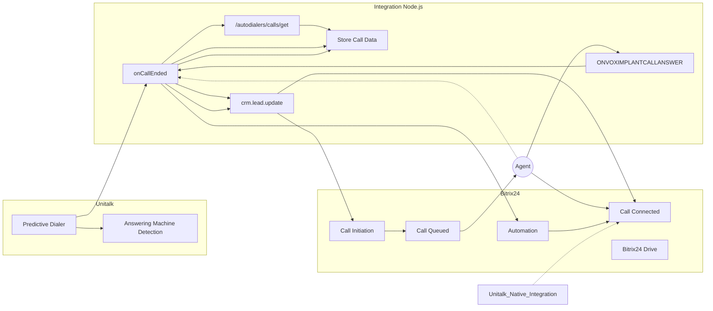

# README.md

# Unitalk & Bitrix24 Integration Markdown Navigation

**Priority Markdowns**
[TO DO / Checklist List](ext_context_markdown\TODO.md)
[README & Unitalk & Bitrix24 Integration Markdown Navigation](README.md)

**Development Resources**
[Unitalk & Bitrix24 API Notes](ext_context_markdown\API_NOTES.md)
[Data Mapping](ext_context_markdown\DATA_MAPPING.md)
[Optimizations & Collaboration](ext_context_markdown\optimizations.md)
[Error Handling & Retry Strategies](ext_context_markdown\ERROR_HANDLING.md)

**Context**
[External AI Conversation History](ext_context_markdown\conversation_history.md)
[LAtest Decisions & Continguency Mitigations](ext_context_markdown\DECISION_LOG.md)

**Project Guidelines & Miscellaneous**
[Project Outline & Requirements Document](ext_context_markdown\outline_&_requirements.md)
[Progress Report](ext_context_markdown\outline_&_requirements.md)

**Deployment Markdowns**
[Deployment Instructions](ext_context_markdown\DEPLOYMENT.md)
[Testing Strategy](ext_context_markdown\TESTING.md)

## Unitalk-Bitrix24 Integration

This repository contains the code for a Node.js-based integration between Unitalk and Bitrix24.

**Project Goal**

To develop a robust integration that enables seamless communication and data synchronization between Unitalk and Bitrix24, leveraging SIP trunking, webhooks, and APIs.

**Key Features**

*   Outbound calling with Unitalk's predictive dialer and AMD (Answering Machine Detection).
*   Real-time agent status synchronization between Unitalk and Bitrix24.
*   CRM updates with call details, outcomes, and AMD results.
*   Call recording storage in Bitrix24 Drive.
*   Dynamic queue assignment based on agent availability and campaign assignments.
*   Automation triggers in Bitrix24 based on call outcomes and AMD results.

**Integration Architecture**

The integration utilizes:

*   Unitalk webhooks to capture call events and trigger actions in Bitrix24.
*   Bitrix24 webhooks to synchronize agent status with Unitalk.
*   Bitrix24 API for CRM updates, automation triggers, and other interactions.
*   Unitalk API for agent status updates and fetching additional call data.
*   Bitrix24 Drive for storing call data and recordings.

## High-Level Architecture

**Implementation Details**

*   The integration is implemented in Node.js using Express.js for handling webhooks and API requests.
*   Axios is used for making HTTP requests to the Unitalk and Bitrix24 APIs.
*   Data mapping between Unitalk and Bitrix24 fields is defined in `DATA_MAPPING.md`.
*   Error handling and retry strategies are outlined in `ERROR_HANDLING.md`.
*   Potential optimizations are documented in `optimizations.md`.
*   The testing plan is described in `TESTING.md`.

**Deployment**

The integration is designed to be deployed on Heroku. Refer to `DEPLOYMENT.md` for detailed instructions.

**Contributing**

Not accepting contributions at the current time.

**License**

This project is licensed under the MIT License. 
This integration code is not open source.
Core Sensitive Code has been obfuscated for security reasons.

**Copyright**
This application is subhect to copyright laws and rightfully owned by ORCA Business Solutions and Abnormal INdustries.
Bitrix24 and Unitalk may utilize code from this integration as subjected in their respective Terms of Serviec and Privacy Policies.

**Please contact me directly on GitHUB for any issues regarding copyright**